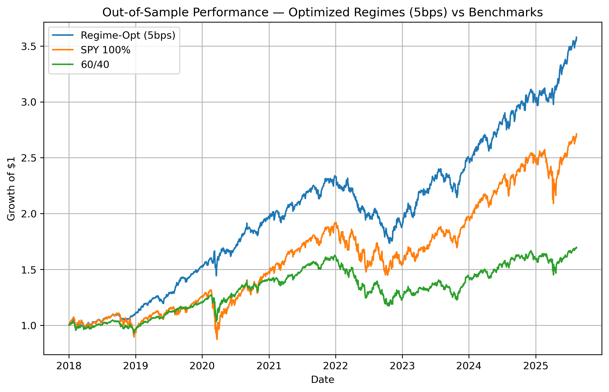

# Project 1: Regime-Switching Portfolio Optimization

This project explores how Hidden Markov Models (HMMs) can be used to detect different market conditions — such as calm bull markets, volatile bear markets, or something in between.  
The idea is simple: if markets behave differently in different regimes, portfolio allocations can adapt to those conditions.

## Project Structure

├── README.md
├── data
│   ├── phase3_final.csv
│   ├── returns.csv
│   └── returns_with_regimes.csv
├── figures
│   └── phase2_spy_regimes.png
├── notebooks
│   ├── archive.ipynb
│   ├── phase1_data_preparation.ipynb
│   ├── phase2_modeling.ipynb
│   ├── phase3_portfolio_backtest.ipynb
│   └── phase4_optimization.ipynb
└── requirements.txt

## Progress

**Phase 1 – Data Collection & Preprocessing (8/3/2025)**
- Pulled adjusted close prices for SPY, TLT, and GLD using `yfinance`
- Calculated daily log returns
- Performed quick visual checks that data looks valid
- Saved clean data to `/data` for later use

**Phase 2 – Regime Detection with HMM (8/7/2025)**
- Trained a 3-state Gaussian HMM on SPY returns using `hmmlearn`
- Classified each trading day into one of three regimes
- Saved labeled returns and a plot showing SPY returns color-coded by regime

**Phase 3 – Strategy Simulation (8/10/2025)**  
- Assign different portfolio weights depending on the current regime
- Compare performance against a 60/40 benchmark portfolio and the SP500

**Phase 4 – Final Analysis (8/11/2025)**  
- Evaluate Sharpe ratio, drawdowns, and regime switching frequency
- Optimize weights to maximize sharpe per regime
- Account for turnover cost during weight changes
- Create a graph comparing optimized regime allocations to benchmarks

**Completed - (8/12/2025)**

## Tools and Libraries

- Python 3.11  
- Jupyter Notebook, VS Code  
- `pandas`, `numpy` - data manipulation and numerical computation
- `matplotlib` - plotting equity curves and results
- `seaborn` - quick visuals
- `yfinance` - market data  
- `hmmlearn` - Hidden Markov Models  

## Results

By using optimized regime based allocations based on market data for 2015-2018, I was able to see significantly better performance out of this regime switching strategy than investing 60/40 SPY/TLT portfolio and simply keeping all your money in SPY during the period of 2018-current. With 5 basis points as the benchmark cost to switch 100% of each investment, this strategy beat the SP500 with a CAGR of ~ 18.3% compared to SPY's ~ 14.1% CAGR, and a Sharpe ratio of ~ 1.47 compared to SPY's ~ .66 Sharpe ratio. Looking back, some factors that could impact these results are short term capital gains tax, slippage when changing allocations, and HMM regimes being calculated using the full dataset (although each day based allocations off of the previous day's regime).

## Author Notes

I’m approaching this as more than just an HMM experiment — the aim is to practice the same workflow a quant might follow: breaking the project into phases, keeping code and data organized, and tracking changes with version control. This is essentially a test run — a way to build my skills and refine my process before tackling a more complex, results-driven project.